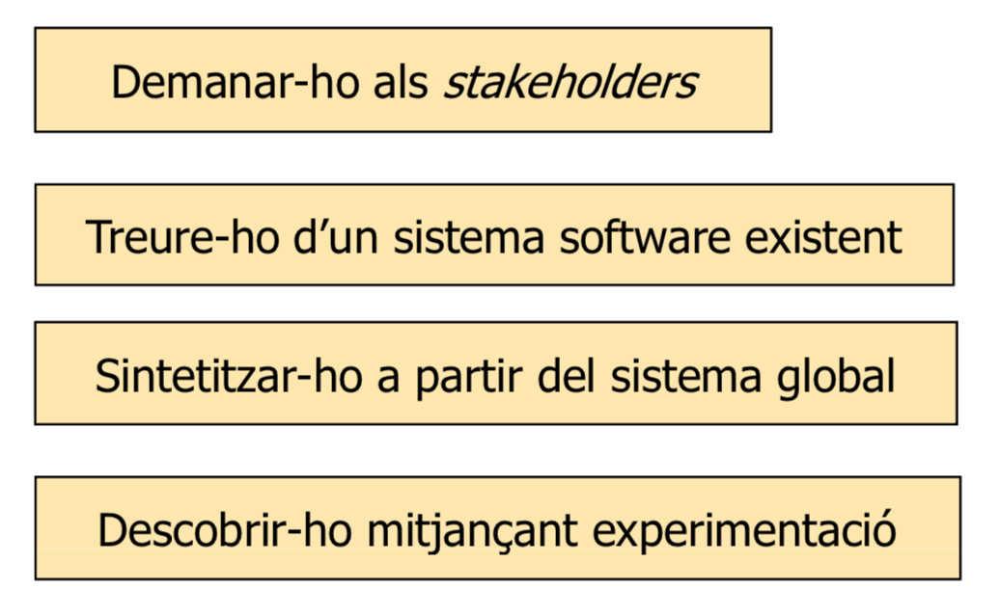

# Ingeniería de requisitos

Detectar qué sistema hace falta construir. Analizar las necesidades de los posibles consumidores y determinar un sistema que las supla.

**Requisito**: Una necesidad o condición para resolver un objetivo.

### Preguntas que hacer para determinar los requisitos

- ¿**Quién**? Y ¿**Qué** quiere?

> Una vez que estableces quién y qué quiere (PROBLEMAS) cada entidad envuelta en un problema.
>
> Determinamos qué clase de REQUISITOS de la aplicación resolvería todos los problemas/objetivos presentados.

Se trata de poner requisitos de la aplicación para ir resolviendo los problemas de la gente.

Los requisitos pueden implicar hardware, software y persones.

### ¿Cómo obtener requisitos?

**stakeholder** --> gente que se ve afectada por el sistema. Las partes interesadas podrían ser los trabajadores de esa organización, sus accionistas, los clientes, etc.

	

### Tipos de requisitos

- Funcionales: describen entradas y salidas, y la relación entre ellas.
	- de datos
	- de proceso

- No funcionales: cualidades generales del sistema
	- económicos
	- estructurales / políticos
	- de calidad
