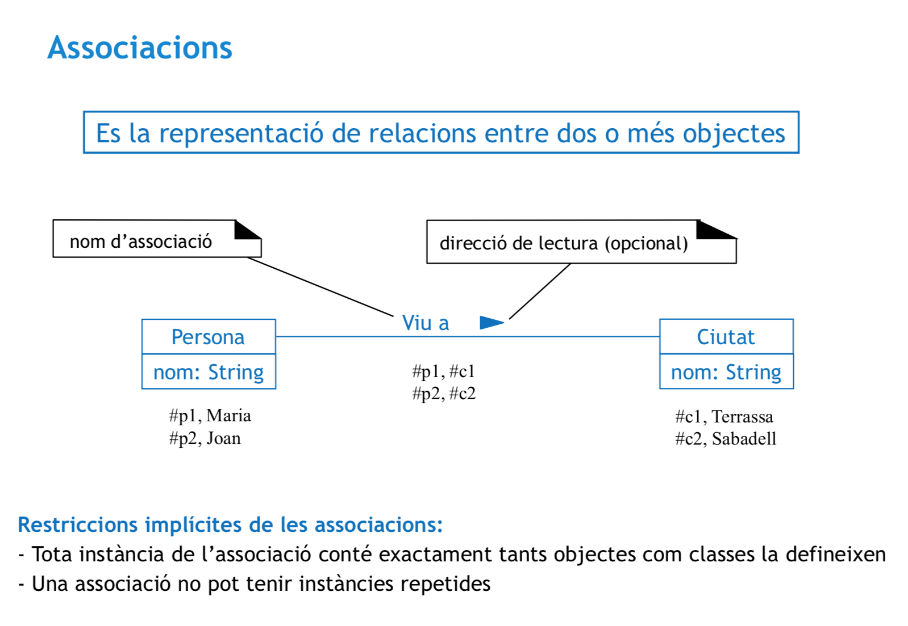

## Casos de Uso en UML

Un caso de uso es una forma detallada de describir un proceso. Un caso de uso es una situación del mundo real.

### Escenario de casos de uso

Hay un escenario principal, alternativos y excepcionales.

> Por ejemplo, cuando compras algo y todo va bien, es escenario principal. Si no tienes saldo, es excepcional y alternativos son pequeñas modificiaciones del principal.

### Actores de casos de uso

Hay actor primario y actor de soporte.

	

### Ejemplo de escenario principal

1. Inicio de la compra.
2. Pasar el producto por el código de barras.
3. Se suma el precio.
4. Se registra el producto (se quita de stock).
5. Suma puntos al cliente.
6. Enseña el precio total al cliente.
7. Si hay más productos, se repiten los pasos del 2 al 6.
8. Acabar la compra.
9. Mostrar el precio.
10. Seleccionar método de pago.
11. Pagar y finalizar.

### Extensiones

- Tienen un nombre.
- **Una condición de activación**.
- Un momento donde se pueden producir (un paso concreto, etc..)

> Ejemplo de posible extensión: Producto no válido.

> Ejemplo de posible extensión: El cliente rechaza el producto (quiere quitar un producto de la compra).

> Ejemplo de posible extensión: El cliente cancela la compra.

# Especificación UML

Todo está bien explicado en las transparencias. Como resumen podría poner estas:

	

	

	

	

