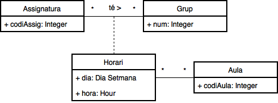

### Clase asociativa

	

> A l'exercici del [Problema 1](../Problemas/Problema%201/) es podria fer així.

	

### Atribut derivat

	

### Generalització / Especialització

	

### Agregació

	

> Agregació: Si quitamos el menú. Las recetas siguen existiendo.
>
> Es como un conjunto de algo.
>
> Las recetas pueden ser de otros menus.

### Composició

	

> Composició: Si quitamos la mano, los dedos de esa mano dejan de existir.
>
> El conjunto de algo, crea obligatoriamente otra cosa.
>
> Unos dedos solo pueden ser de una mano.

	

> Singleton: solo existe una instancia.

	

> Xor: o esto, o esto, ambas no.

> Subset: Subjconjunto de otra asociación.
